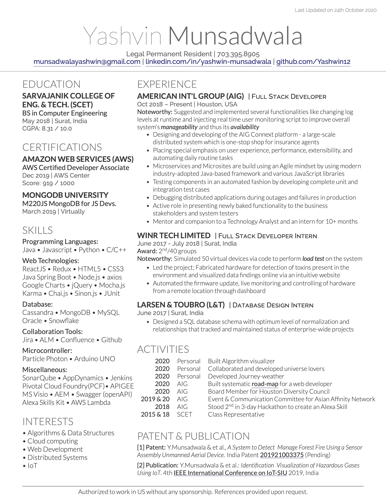

# Resumeme 📄
A one-page, two asymmetric column resume made with the help of [Deedy-Resume](https://github.com/deedy/Deedy-Resume) template in XeTex. I've used OpenFonts template out of two available. 

## Preview 👀 

## How is this resume built? 🏗️
Resume is built using [Overleaf](https://www.overleaf.com/). It is a LaTeX editor which is used for editing and previewing documents.